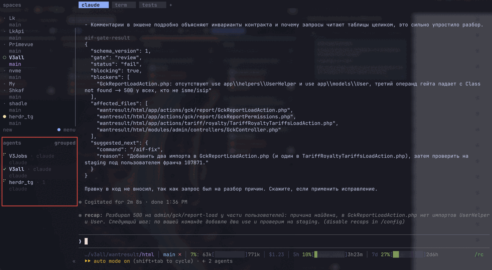
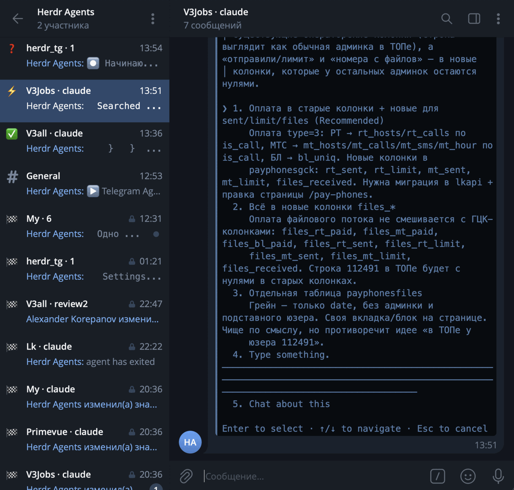

# Telegram Agents for Herdr

> One Telegram forum topic per live Herdr agent: status in the topic icon, messages both ways.

A [Herdr](https://herdr.dev) plugin that mirrors the Herdr **Agents** panel into a
Telegram forum supergroup, so you can watch and drive your coding agents
(Claude Code, Codex, Gemini, ...) from a phone. Every agent gets its own topic,
the topic icon follows the agent's status, its questions land in the topic with
a notification, and what you write there goes back to the agent. One command
installs it; no Go, no Node, nothing else on your machine.



*The Herdr agents panel: three agents, one working, one idle, one waiting.*



*The same agents in Telegram: one topic each, the icon is the status, and the
open topic shows a Claude Code question you can answer from the phone.*

## What you get

- **A topic per agent**, named like the Agents panel row (`V3Jobs · claude`),
  created when the agent appears and reused after a restart.
- **Status at a glance**: the topic icon is ⚡ working, ✅ idle, ❓ blocked,
  🏆 done, 👀 unknown, 🏁 exited.
- **Questions come to you**: when an agent gets blocked on a question or an
  approval, the screen is posted with a notification and, for a numbered
  dialog, with one button per option; when it finishes, the tail is posted
  silently.
- **Answers go back**: plain text becomes a prompt, `y` / `n` / `1`..`9` /
  `enter` / `esc` answer dialogs, `/keys` sends raw keys.
- **Look at the screen** with `/screen`, or `/screen all` for everything the
  agent printed since your last message.
- **Claude Code commands** `/clear`, `/compact`, `/usage`, `/model` are typed
  into the agent and the result is posted back.
- **Rename or close** a topic in Telegram to rename or mute the agent in Herdr.
- **A control panel** in the General topic: `/status` with links to every
  agent, `/options`, `/away`, `/here`, `/help`, daemon notices.
- **Quiet while you are at the machine**: topic edits wait and screen posts
  go silent while your keyboard or mouse is active; when you leave,
  everything catches up and a question still waiting rings once. macOS and
  Windows; Linux has no idle source yet.
- **Settings from the phone**: `/options` opens a panel with buttons to pause
  the mirror, tune quiet mode, pick the status icons, mask secrets in posts
  and delete the topics of exited agents after a while.
- **A daemon that looks after itself**: starts with Herdr, exits when Herdr
  is gone, heals topic drift on start and on `resync`.

Version `0.4.0`. macOS and Linux are verified end to end; Windows is built and
unit-tested on every change but has not been run against a real Herdr yet.

## Requirements

- Herdr `0.7.5` or newer
- A Telegram bot token from [@BotFather](https://t.me/BotFather)
- A Telegram supergroup with **Topics** enabled, where you can promote the bot
- `sh` and `curl` (macOS, Linux) or PowerShell 5.1+ (Windows) for the install step

## Install

```bash
herdr plugin install permgps/herdr-telegram-agents
```

Herdr clones the repository and runs the plugin's build step, which downloads
the release binary for your OS and architecture into `bin/`, verifies its
SHA-256 against the release checksums and makes it executable. Supported
targets: `darwin/amd64`, `darwin/arm64`, `linux/amd64`, `linux/arm64`,
`windows/amd64`. The plugin is listed on the
[Herdr marketplace](https://herdr.dev/plugins/); the command above is the one
the card shows.

Then run the setup below. Herdr shows the **Telegram Agents** actions listed
further down and runs `bin/herdr-tg startup` after every session restore.

If you download a binary with a browser instead, macOS marks it quarantined;
`xattr -d com.apple.quarantine bin/herdr-tg` clears that. Binaries fetched by
the install script carry no quarantine attribute.

## Setup

1. Create a bot with @BotFather and copy its token.
2. Create a supergroup and enable **Topics** in its settings (this makes it a
   forum). You must be its owner or an administrator who can add admins.
3. In Herdr run the action **Telegram Agents: setup** (from a Herdr pane:
   `herdr plugin action invoke permgps.telegram-agents.setup`). A popup asks
   for the token (typed visibly; the popup closes when setup ends) and prints
   a `https://t.me/<bot>?start=setup` link.
4. Open the link, press **Start** and tap **Choose group**. Telegram lists your
   forum groups and adds the bot to the one you pick as an administrator with
   **Manage topics** and **Delete messages**. The person who picks the group
   becomes the operator. Adding the bot to a forum group by hand with those
   rights works as well.
5. Back in the popup confirm the group. The wizard saves `config.json` and
   starts the daemon. From now on the daemon starts automatically with Herdr
   while a configuration exists.

Run the setup action again to reconfigure; it asks before overwriting. The
token, the mapping, the options and the logs live in Herdr's plugin config
and state directories; the files are listed under
[Files, logs and state](docs/behaviour.md#files-logs-and-state).

## Talking to agents

A blocked agent posts its screen with a notification, a finished one posts
its tail silently. Anything you write in the agent's topic goes back:

| You write | The agent gets |
|-----------|----------------|
| plain text | typed as a prompt and submitted |
| `y`, `n`, `1`..`9`, `enter`, `esc` while the agent is blocked | the matching key; a button under the question does the same |
| `/keys esc enter` | raw key names |
| `/screen`, `/screen 40`, `/screen all` | the visible screen, its last 40 lines, or everything since your last message |
| `/focus` | the pane is brought to the front in Herdr |
| `/clear`, `/compact`, `/usage`, `/model` | typed into an idle agent as a Claude Code command; the result is posted back |
| `/status`, `/help` | this agent's status line, the command list |

The **General** topic is the control panel: `/status` lists every agent with
a link to its topic, `/options` opens the settings panel, `/away [2h]` and
`/here` override the presence check, `/help` lists the commands, and the
daemon posts its notices there. Only the configured group and the operators
from setup are accepted.

Timings, buttons, how the Claude Code commands are forwarded, how `/screen
all` collects its history and what `/status` shows in General are in
[docs/commands.md](docs/commands.md).

## Settings

`/options` in General opens a panel of buttons, one message edited in place.
Its groups:

| Group | What it holds |
|-------|---------------|
| Sync | `Herdr → Telegram sync`: untick to pause topic edits and screen posts; what you send keeps working |
| Quiet | quiet mode while you are at the desk: `Away after` (3 min), `Hold topic edits`, `Screen posts` (Silent, Held, Normal), `Re-announce on leaving` |
| Posts | `Done post`: what a finished agent posts, the screen tail (default), its last reply from the Claude Code transcript, or that reply rendered with bold, lists, links and code |
| Appearance | one topic icon per status, from Telegram's topic-icon pack |
| Privacy | `Redact secrets`: API keys, tokens, passwords and private keys are masked in every post |
| Topics | `Delete closed topics after`: the topics of exited agents go after 30 days by default |

The choices are saved in `options.json` and survive restarts. Every option,
its default and what it does: [Options](docs/behaviour.md#options); how
presence is measured and what happens when you leave:
[Quiet while at the desk](docs/behaviour.md#quiet-while-at-the-desk); which
secrets are masked: [Secrets in posts](docs/behaviour.md#secrets-in-posts);
when topics are deleted: [Topic cleanup](docs/behaviour.md#topic-cleanup).

## Actions

| Action | What it does |
|--------|--------------|
| `Telegram Agents: setup` | Opens the setup popup |
| `Telegram Agents: start` | Starts the daemon if it is not running |
| `Telegram Agents: stop` | Asks the daemon to exit (SIGTERM as the Unix fallback, then SIGKILL after 10 s) |
| `Telegram Agents: restart` | Stop followed by start |
| `Telegram Agents: status` | Whether the daemon runs, its pid and uptime, and the daemon's own line: version, live agents, dropped jobs, Herdr socket health, sync, topic cleanup and quiet state |
| `Telegram Agents: resync` | Asks the running daemon to re-check every topic against the live agents |
| `Telegram Agents: logs` | Opens an overlay with the last 100 log lines and follows the file |
| `Telegram Agents: doctor` | Opens an overlay with one line per check: config, options, bot token, group rights, Herdr socket and version, daemon, mapping file |
| `Telegram Agents: send test message` | Posts a test message into General straight from the action (the daemon need not run) and reports the outcome |

Every action reports its outcome as a Herdr notification. `stop`, `resync`
and `status` talk to the daemon through a local control channel; see
[Files, logs and state](docs/behaviour.md#files-logs-and-state).

## Upgrade

Herdr has no `plugin update`: reinstall to move to a newer version.

```bash
herdr plugin uninstall permgps.telegram-agents
herdr plugin install permgps/herdr-telegram-agents
```

The two commands name the same plugin in the two forms Herdr uses: `uninstall`
takes the plugin id, as printed by `herdr plugin list`, and `install` takes the
GitHub repository.

Your `config.json`, `mapping.json`, `options.json` and the Telegram topics
survive: Herdr keeps the plugin's config and state directories and never
deletes their contents, so the daemon picks up the same group and the same
topics after the upgrade. The manifest version always equals the release
tag, so a checkout runs the binary that tag was built from.

## Documentation

| Page | What it covers |
|------|----------------|
| [docs/commands.md](docs/commands.md) | What gets posted, every command in a topic and in General, the Claude Code commands, `/screen all` |
| [docs/behaviour.md](docs/behaviour.md) | Topic naming and icons, exit and resume rules, manual rename and close, the options panel, quiet mode, secret redaction, topic cleanup, files and logs |
| [docs/development.md](docs/development.md) | Building from source, `make` targets, publishing a release, the `dev` subcommand, the tree layout |
| [docs/testing.md](docs/testing.md) | Automated gates and the manual checklist run before a release |

## License

[MIT](LICENSE).
