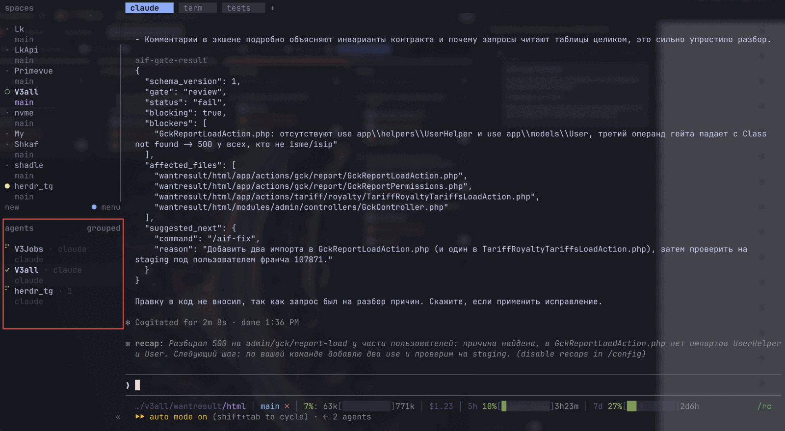
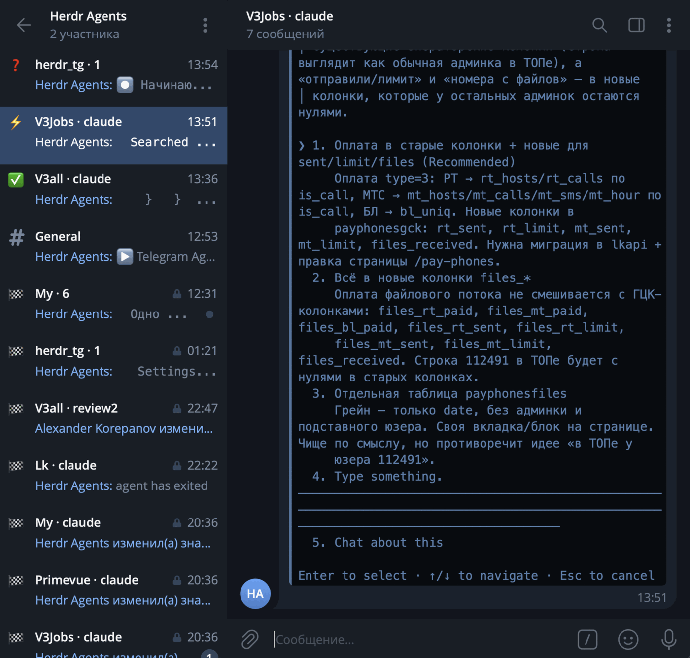

# Telegram Agents for Herdr

> One Telegram forum topic per live Herdr agent: status in the icon and messages both ways.

A [Herdr](https://herdr.dev) plugin for watching and controlling coding agents
from a Telegram forum group. Each live agent gets a topic. Questions and
completion posts arrive there; replies and command buttons go back to the
agent. The bot can also ring an operator in a private chat when an agent needs
an answer.

**Hand your agent to someone else.** Any Telegram user can be given an agent
for an hour, a day, a week or until you take it back: they watch it, or drive
it, from their own private chat with the bot. They need no Herdr, no access to
your machine and no seat in your group. See [Share an agent](#share-an-agent).




## Install

You need Herdr 0.7.5 or newer, a bot token from [@BotFather](https://t.me/BotFather),
and a Telegram supergroup with Topics enabled. The install step needs `sh` and
`curl` on macOS or Linux, or PowerShell 5.1+ on Windows.

```bash
herdr plugin install permgps/herdr-telegram-agents
```

Herdr downloads a signed, checksum-verified release binary. The install
script checks the signature with `ssh-keygen` (OpenSSH 8.1 or newer, present
on macOS, most Linux distributions and Windows 10+). Without it the script
warns and trusts the release checksums alone. Published targets are
macOS and Linux on amd64 and arm64, and Windows on amd64. The plugin needs no
Go toolchain on the machine where it is installed.

## Setup

1. Create a bot with @BotFather and a supergroup with Topics enabled.
2. In a Herdr pane, run `herdr plugin action invoke permgps.telegram-agents.setup`.
3. Enter the token in the popup (input is hidden), open its bot link, press **Start**, and add
   the bot to the group with **Manage topics**, **Delete messages**, and
   **Pin messages**. The link carries a one-time code: only the account that
   opens it can select the group, and it becomes an operator. Promote the bot
   as yourself, not as an anonymous admin. A promotion by hand counts only
   when it comes from that account and happens after setup started; one done
   earlier is ignored, so grant the right again.
4. Confirm the group in the popup. The daemon starts and later starts with
   Herdr automatically.
5. Mute the group if frequent topic icon notices are distracting. Agent
   questions can still ring in the bot's private chat.

## Use

Write in an agent's topic to prompt it. A short reply such as `y`, `n`, `1`,
`enter`, or `esc` answers a blocked agent; numbered questions also have
buttons. `/screen` shows the screen, or the last readable reply for idle or
done OpenCode, Codex, Antigravity, Pi and Muse agents. `/keys` sends raw keys, and `/git` shows
allow-listed repository information. Photos, documents, voice notes, audio,
and video sent to a topic are saved in the plugin inbox and passed to the
agent as file paths.

For readable OpenCode replies, run `herdr integration install opencode` and
make sure the `opencode` executable is on the plugin daemon's `PATH`. Without
an exact session reference, `/screen` falls back to the visible terminal.

In General, `/status` shows all agents, `/new` starts one, and `/options`
opens the settings panel. The panel controls syncing, notification behavior,
icons, redaction, and cleanup. The pinned dashboard shows the same agent
statuses, plus the Codex usage windows and, once the status line tap from
`doctor` is installed, Claude's 5-hour and weekly quota. Operators can add
read-only observers with `/observers`.

See [Commands](docs/commands.md) for every command and attachment rule, and
[Behavior](docs/behaviour.md) for sync, settings, access, and daemon details.

## Share an agent

Most remote controls for coding agents stop at "you, on your phone". This one
also lets you lend a running agent, with its session, context and tools, to
another person for a while:

- **A teammate takes over** a task while you are offline, without a handover
  call or a copy of your environment.
- **A reviewer or client watches** the agent work live, read-only, and asks
  for a screen when they want one.
- **A colleague pairs with you** on the same session from their own phone,
  each typing into it.

The recipient only needs Telegram. They message your bot once, you run
`/share` in the agent's topic, pick them, and choose:

- **Read**: status, screens and the agent's new output in their private topic.
- **Control**: they can also prompt the agent, answer its questions, press its
  buttons, send keys and files, and stop it.
- **How long**: one hour, one day, seven days, or until you revoke it.

They see only the agents you shared, never your group or your other agents,
and secrets are always masked in what they receive. `/shares` changes rights,
suspends, resumes or revokes at any time. A grant ends by itself when it
expires and is suspended when the agent's session changes. Control runs in
your agent's session with its permissions on your machine, so grant it to
people you would let type into that terminal.

Enable Threaded Mode for the bot in BotFather first. Step-by-step: the
[private sharing walkthrough](docs/commands.md#sharing-an-agent-privately).

## Check for updates

Open `/options` in General and press **Check for updates**. The first press
checks published GitHub releases, including prereleases, and shows the newest
higher version. If the installation is eligible, press **Update** separately
to authorize installation. The panel shows progress and the final result.
There are no scheduled checks or unattended installations.

Only releases signed by the maintainer's key are offered. An unsigned one
shows "not signed yet". A managed GitHub installation is reinstalled at the
exact release tag and must resolve to the signed commit. A clean locally
linked checkout on `main` fast-forwards to the release commit and runs the
checksum-verified installer. An intentionally pinned managed
installation, a dirty or detached local checkout, or a source from another
repository shows a reason without an Update button. The previous version is
restored when a replacement fails to start; inspect `update.json` and
`daemon.log` if recovery itself fails.

See [Update behavior and recovery](docs/behaviour.md#plugin-updates) for
checks, state, and manual commands.

## Documentation

| Page | Contents |
|------|----------|
| [Commands](docs/commands.md) | Topic and General commands, posts, buttons, attachments |
| [Behavior](docs/behaviour.md) | Sync rules, settings, updates, access, state and logs |
| [Development](docs/development.md) | Source builds, release process, updater internals |
| [Testing](docs/testing.md) | Automated gates and manual release checks |

## License

[MIT](LICENSE).
